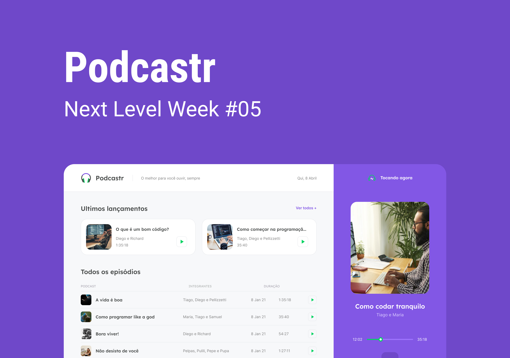

  

## Description
Projeto Podcast do NLW#5 - Rocketseat

## Usage

1. Clone repository using by running `$ git clone https://github.com/Luke-Henry-Santos/Podcast-NLW-5/` in yout terminal
2. Navigate into the directory
3. Install Node JS and NPM or Yarn
4. Run `$ npm i` or `$ yarn` to install the required packages
5. Run `$ yarn dev` or `$ npm dev` if you want to run the project as a developer or run `$ yarn build` or `$ npm build` to generate a project build.
6. Run `$ yarn start` or `$ npm start` to run it

7. Run `$ yarn server` or `$ npm server` to run the server 